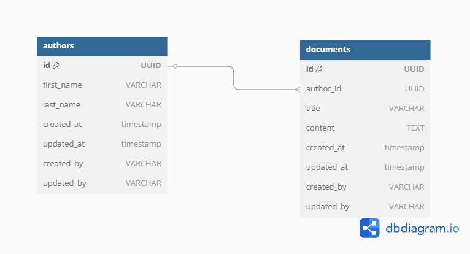

# 📚 Project-Based-Mentorship-Go-App

A simple Go application to perform CRUD operations with PostgreSQL using Gin and GORM.  
It serves as a backend for a project-based mentorship platform managing authors, documents, and more.

---

## 📖 Project Description

This backend system manages mentorship data using RESTful APIs built with Go.  
The project follows clean architecture, integrates Swagger for API documentation, and supports scalable deployment using Docker or Kubernetes.

---

## 💃 Database Schema (ERD)



---

## 🚀 How to Run the Project Locally

### Prerequisites

- ✅ Go 1.20+
- ✅ PostgreSQL installed and running
- ✅ (Optional) Docker & Docker Compose

### 1. Clone the Repository

```shell
git clone https://github.com/7lawa9111/Project-Based-Mentorship-Go-App.git
cd Project-Based-Mentorship-Go-App
```

### 2. Create `.env` File

```shell
cp .env.example .env
```

Edit `.env` and fill in your PostgreSQL credentials.

### 3. Install Dependencies

```shell
go mod tidy
```

### 4. Run the Application

```shell
go run main.go
```

---

## 📂 Project Directory Structure

```text
Project-Based-Mentorship-Go-App/
├── config/                   # Configuration setup
├── database/                 # PostgreSQL DB connection
├── docs/                     # Swagger documentation files
├── handlers/                 # Business logic and controllers
├── k8s/                      # Kubernetes configuration files
├── models/                   # GORM models for DB
├── routes/                   # API routes
├── .env                      # App environment variables
├── .env.example              # Example of .env
├── .gitignore                # Git ignore rules
├── App Technical Specs.md    # Additional specs
├── document_DB_Diagram.png   # Database schema image
├── go.mod                    # Module dependencies
├── go.sum                    # Dependency checksums
├── main.go                   # App entry point
└── README.md                 # This file
```

---

## 📘️ API Documentation (Swagger)

To generate Swagger docs:

```shell
swag init
```

Serve Swagger UI at:

```
http://localhost:8080/swagger/index.html
```

You’ll see endpoints like:

- `POST /authors`
- `POST /documents`

---

## 👥 Contributors

- [@7lawa9111](https://github.com/7lawa9111) – Creator & Maintainer
- [@mariamkhaled99](https://github.com/mariamkhaled99) – Contributor
- [@RoadmannCoder](https://github.com/RoadmannCoder) – Contributor


---

## 🔗 Project Link

[🔗 GitHub Repository](https://github.com/7lawa9111/Project-Based-Mentorship-Go-App)

---

## 🛠️ Built With

- [Gin](https://github.com/gin-gonic/gin) – HTTP Web Framework
- [GORM](https://gorm.io/) – ORM Library
- [Swaggo](https://github.com/swaggo/swag) – Swagger Generator
- [PostgreSQL](https://www.postgresql.org/) – Relational Database
- [Docker](https://www.docker.com/) – Containerization Platform
- [Kubernetes](https://kubernetes.io/) – Container Orchestration Platform
